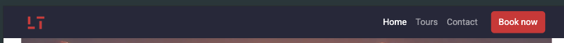
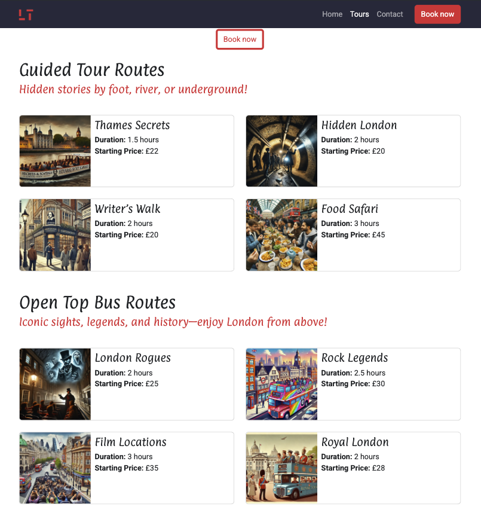
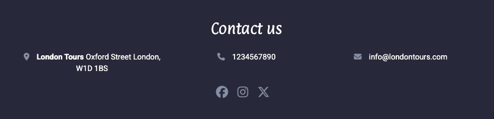
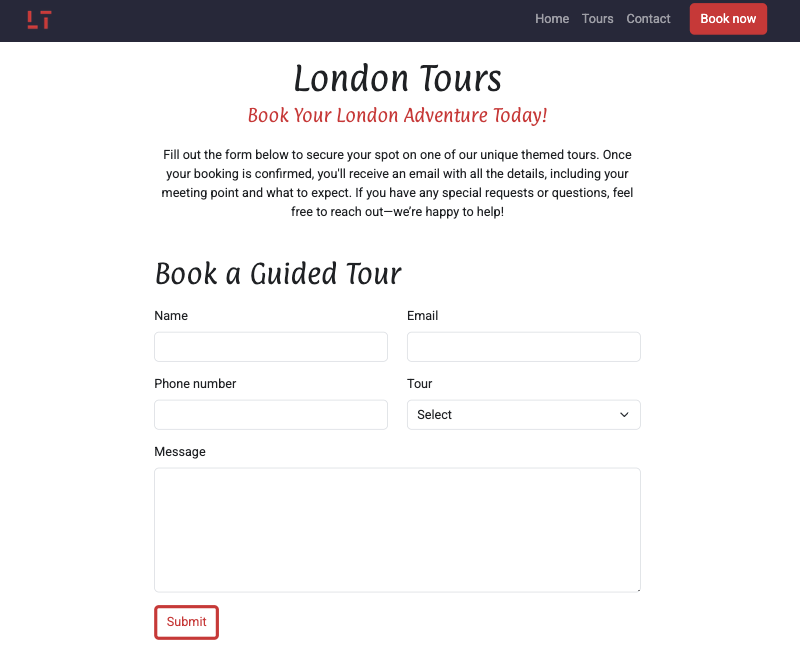
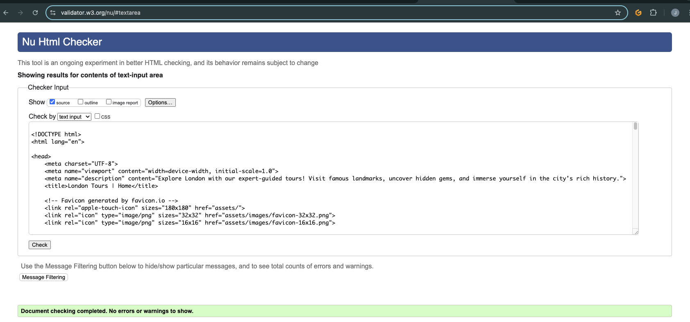
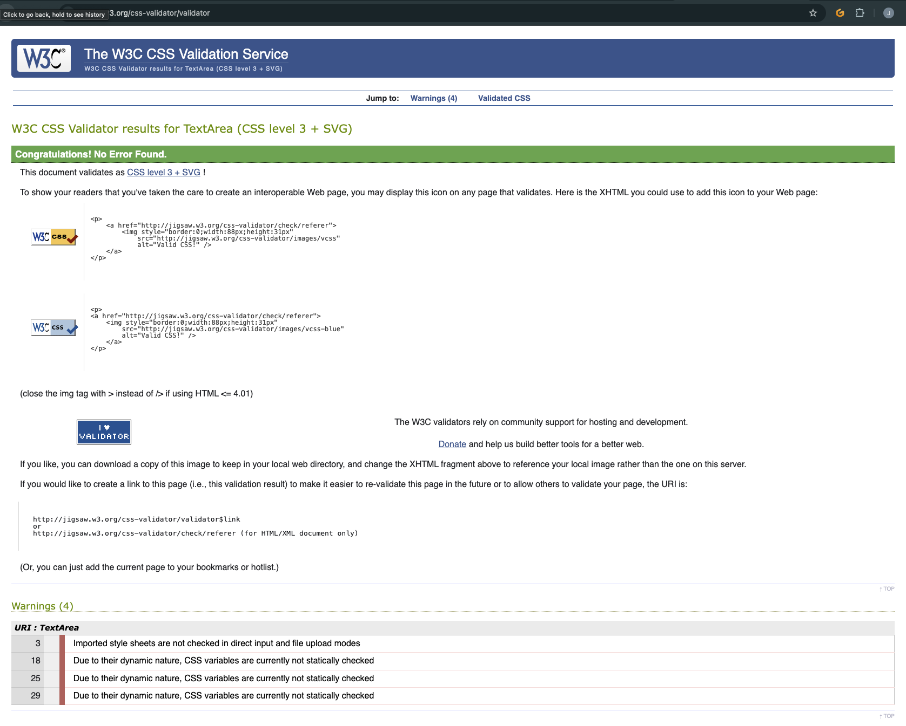
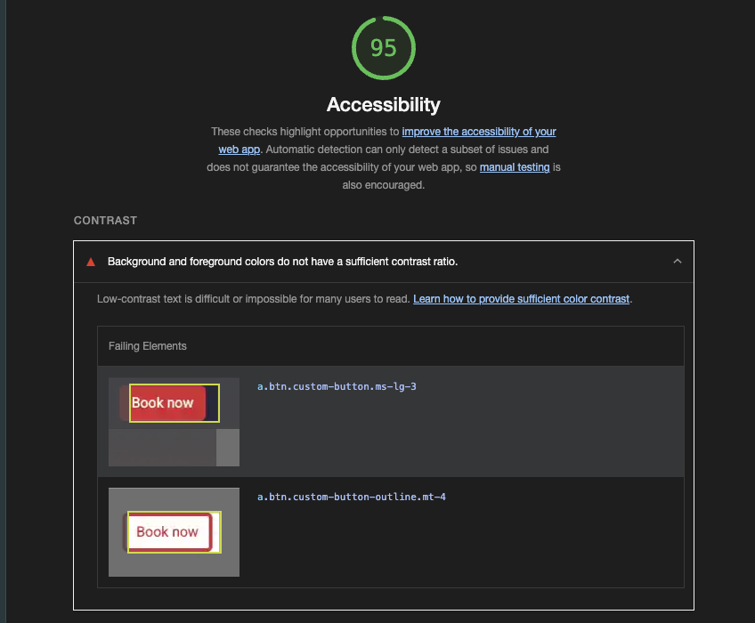
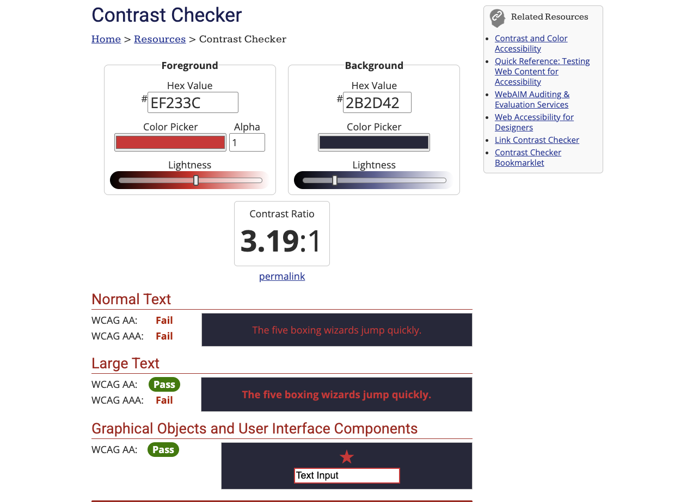

## UX
### Project Goals
#### As a developer
The main project goal is to showcase my abilities to build a website that is responsive for different size screens and follows the best practices for web development. 

#### As a business
London Tours is a made up business that offers guided tours in London. The goal as a small business is to increase the number of customers.

### Design Choices
The layout was inspired by the BoardWalk Games project from the Code Institute.
Some of the style choices for this project:
#### Colour pallet:
* Primary colour; #2b2d42.
* Secondary colour; #ef233c.
* Highlight colour; #8d99ae.
* Highlight colour light; #edf2f4.
#### Fonts:
The font were imported from google fonts
* Roboto as the primary font for the body.
* Paprika as the secondary font for headings and lead texts.
### User Stories
1. As a user, I need easy navigation and user-friendly design, so I can find information quickly.
  - Acceptance Criteria: 
    * The website is responsive across various screen sizes.
    * The layout and navigation are intuitive
  - Tasks:
    * Apply responsive design using Bootstrap.
    * Arrange the navigation based on best practices.

    
2. As a tourist, I want a selection of different tours with various themes so I can book a tour that matches my personal interests.
  - Acceptance Criteria: 
    * The website has a separate page for the list of different guided tours.
    * Use card components for consistency in layout and responsiveness.
  - Tasks:
    * Create a Tours page featuring all different tour themes.

    
3. As a Customer, I need to find essential information such as location, contact details and duration of each tour so I can plan my visit in the most efficient manner.
  - Acceptance Criteria: 
    * The website contains a dedicated section for contact details and location.
    * The tour section should clearly display the duration and price of each tour.
  - Tasks:
    * Design and place a section for location and contact details.
    * Ensure that each card displays the duration and price of each tour.

    
4. As a customer, I want to be able to book a tour easily without frustration.
  - Acceptance Criteria: 
    * A booking form that includes all necessary fields.
    * All fields must be completed before the user can submit the form.
    * The user must receive feedback when the form is completed correctly.
  - Tasks:
    * Implement a booking form from Bootstrap.
    * Implement HTML validation on the form.
    * Create a success page to direct users after the form is submitted correctly.

    

## Technologies Used
I used Git pod, a cloud based IDE, to create this project. After every change I would save and upload the code to gitHub using the git commands in the terminal.

The languages used were HTML and CSS. Also used Bootstrap cards, navbar and its grid system for responsiveness on different size screens.
## Testing
### Manual Testing
All internal links were tested manually. Checked that all navbar items sent you to the correct page and that all the CTA buttons took you to the booking form. Checked that all form sections had to be filled out and in the correct manner.

To ensure a responsive design all layouts were checked for different size screens.
### Automatic Testing
W3C Markup Validation service used on all HTML pages and received no errors.

W3C CSS Validation service used on the style.css sheet and received no errors.

Used Lighthouse in the chrome developer tools to test performance, accessibility and best practices. This gave me a good overall score.

The only error received on the accessibility section was an insufficient contrast ratio between the background and the foreground colors of the buttons.

This was tested again using [webaim.org](https://webaim.org/resources/contrastchecker/). The contrast passed for graphical objects and user interface components. Since these colours were used for button components I decided to leave them.

## Deployment
The website was deployed with gitHub. For this I used Gitpod as a cloud based IDE to build the site, then I would use git commands to save and upload my work onto gitHub.

To deploy the website on gitHub:
* I opened my project in gitHub
* Went to settings
* I settings select Pages in the code and automation section
* Selected main as the branch
* Select root as the folder

Once those settings were saved the website deployed a couple of seconds after.
## Credits
* The project was created using The Codes Institute's template.
* The color pallet was chosen from [coloors.co](https://coolors.co/palette/2b2d42-8d99ae-edf2f4-ef233c)
* The fonts were imported form Google fonts
* All images were created with ChatGPT
* All images were optimized for web with [tinypng.com](https://tinypng.com/)
* All favicons were imported from [favicon.io](https://favicon.io/)
* Icons fot the footer and home page were imported from [fontawesome.com](https://fontawesome.com/)
* The logo was created using @oxana-stoyantseva free template from [canva.com](https://www.canva.com/)
